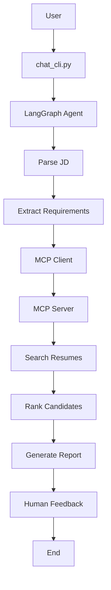

# Resume Matching Agent Workflow

```mermaid
flowchart TD

A[User]

B[chat_cli.py]

C[LangGraph Agent]

D[Parse JD]

E[Extract Requirements]

F[MCP Client]

G[MCP Server]

H[Search Resumes]

I[Rank Candidates]

J[Generate Report]

K[Human Feedback]

L[End]

A --> B
B --> C
C --> D
D --> E
E --> F
F --> G
G --> H
H --> I
I --> J
J --> K
K --> L
```